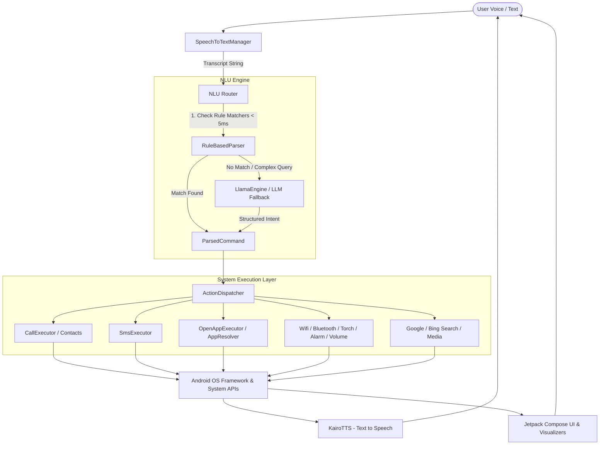

# Kairo - Complete Project Architecture & Documentation

Kairo is a privacy-focused, high-performance voice assistant for Android. It combines instant rule-based Natural Language Understanding (NLU), on-device Large Language Model (LLM) fallback inference, and direct Android system integration using Jetpack Compose and Kotlin Coroutines.

---

## 🏛️ System Architecture

Kairo follows a clean, decoupled architecture: Speech Input $\rightarrow$ Natural Language Understanding (NLU Router) $\rightarrow$ Action Dispatcher $\rightarrow$ System Executors $\rightarrow$ Voice Output (TTS) & UI State Update.



---

## 📁 Repository & Directory Structure

```
c:\gogles kairo\
├── app/
│   ├── build.gradle.kts                      # Main application Gradle build script
│   ├── proguard-rules.pro                    # R8 / ProGuard optimization & log stripping rules
│   └── src/
│       ├── main/
│       │   ├── AndroidManifest.xml           # App manifest, permissions & system services
│       │   ├── assets/                       # Local model assets
│       │   ├── java/com/kairo/assistant/
│       │   │   ├── KairoApplication.kt       # Application entry point
│       │   │   ├── MainActivity.kt           # Single activity hosting Jetpack Compose UI
│       │   │   ├── actions/                  # 16 Action Executors & ActionDispatcher
│       │   │   ├── audio/                    # Audio recording & waveform utilities
│       │   │   ├── data/                     # Package & Contact resolving engines
│       │   │   ├── nlu/                      # Rule-based intent matchers & LLM parser engine
│       │   │   │   ├── llm/                  # llama.cpp native bindings for GGUF models
│       │   │   │   ├── models/               # ParsedCommand & IntentType data structures
│       │   │   │   └── rules/                # 17 intent rule matchers
│       │   │   ├── receiver/                 # KairoDeviceAdminReceiver for device locking
│       │   │   ├── service/                  # Android VoiceInteractionService integration
│       │   │   ├── stt/                      # SpeechToTextManager (SpeechRecognizer wrapper)
│       │   │   ├── tts/                      # KairoTTS (TextToSpeech engine wrapper)
│       │   │   ├── ui/                       # Jetpack Compose UI screens, components & theme
│       │   │   └── viewmodel/                # KairoViewModel state management
│       │   └── res/                          # Vector drawables, themes, strings, XML configs
│       └── test/                             # Automated unit test suite
├── benchmark/                                # AndroidX Macrobenchmark module for startup testing
├── release.keystore                          # Custom production signing keystore
├── app-v2.apk                                # Final compiled production release APK
├── README.md                                 # User-facing summary & installation guide
└── PROJECT_DOCUMENTATION.md                  # Detailed technical architecture document
```

---

## 🧠 Natural Language Understanding (NLU) Pipeline

Kairo uses a **hybrid dual-layer NLU strategy**:

1. **Rule-Based Pattern Matchers (Primary Layer)**:
   * **Latency**: $< 5\text{ ms}$
   * **Resource Usage**: Virtually zero CPU / memory footprint
   * **Engine**: [Router.kt](file:///c:/gogles%20kairo/app/src/main/java/com/kairo/assistant/nlu/Router.kt) evaluates text transcripts through 17 specialized rule matchers:
     * `CallIntentMatcher`: Matches "call mom", "dial dad", "make a call to John".
     * `SmsIntentMatcher`: Matches "text mom hello", "send message to Dave".
     * `AlarmIntentMatcher`: Matches "set alarm for 7 AM", "wake me up at 8".
     * `WifiIntentMatcher`: Matches "turn on wifi", "disable wi-fi".
     * `BluetoothIntentMatcher`: Matches "enable bluetooth", "turn off bluetooth".
     * `TorchIntentMatcher`: Matches "turn on flashlight", "torch off".
     * `LockDeviceIntentMatcher`: Matches "lock screen", "lock device".
     * `OpenAppIntentMatcher`: Matches "open WhatsApp", "launch Youtube".
     * `MediaIntentMatcher`: Matches "play music", "pause song", "next track".
     * `InternetIntentMatcher`: Matches "search web for space news".
     * `VolumeIntentMatcher`: Matches "mute volume", "set volume to 80%".
     * `SettingsIntentMatcher`: Matches "open settings", "wifi settings".
     * `HotspotIntentMatcher`: Matches "turn on hotspot".
     * `AirplaneModeIntentMatcher`: Matches "airplane mode".
     * `GoogleSearchIntentMatcher`: Matches "google search...".
     * `BingSearchIntentMatcher`: Matches "bing search...".
     * `GreetingIntentMatcher`: Matches "hello", "hi kairo".

2. **On-Device LLM Fallback (Secondary Layer)**:
   * **Engine**: [LlamaEngine.kt](file:///c:/gogles%20kairo/app/src/main/java/com/kairo/assistant/nlu/llm/LlamaEngine.kt) via `org.codeshipping:llama-kotlin-android`.
   * **Model**: Quantized GGUF LLaMA model (`kairo_model_v7.gguf`) loaded locally in app files.
   * **Behavior**: Evaluated on demand for complex or ambiguous user queries that fail rule matching. Automatically unloaded when idle to preserve system RAM and CPU.

---

## ⚡ Action Execution Layer

When an intent is resolved into a [ParsedCommand](file:///c:/gogles%20kairo/app/src/main/java/com/kairo/assistant/nlu/models/ParsedCommand.kt), [ActionDispatcher.kt](file:///c:/gogles%20kairo/app/src/main/java/com/kairo/assistant/actions/ActionDispatcher.kt) routes execution to the corresponding handler:

| Action Executor | Capability & System API Integration |
|---|---|
| **CallExecutor** | Searches contacts via [ContactResolver](file:///c:/gogles%20kairo/app/src/main/java/com/kairo/assistant/data/ContactResolver.kt) (with Levenshtein fuzzy matching); initiates direct `ACTION_CALL` or opens dialer. Supports dual-SIM selection. |
| **SmsExecutor** | Resolves contact phone number and dispatches direct SMS via `SmsManager` or pre-fills SMS intent. |
| **AlarmExecutor** | Sets clock alarms using `AlarmClock.ACTION_SET_ALARM` without requiring extra UI taps. |
| **WifiExecutor** | Toggles device Wi-Fi state using `WifiManager` or opens system panel on modern Android versions. |
| **BluetoothExecutor** | Manages Bluetooth state using `BluetoothAdapter`. |
| **TorchExecutor** | Toggles camera flashlight hardware using `CameraManager.setTorchMode`. |
| **LockDeviceExecutor** | Instantly locks screen using `DevicePolicyManager` via [KairoDeviceAdminReceiver](file:///c:/gogles%20kairo/app/src/main/java/com/kairo/assistant/receiver/KairoDeviceAdminReceiver.kt). |
| **OpenAppExecutor** | Resolves installed application packages using [AppResolver](file:///c:/gogles%20kairo/app/src/main/java/com/kairo/assistant/data/AppResolver.kt) and launches the target application intent. |
| **MediaExecutor** | Sends media key events (`KEYCODE_MEDIA_PLAY`, `PAUSE`, `NEXT`, `PREVIOUS`) via `AudioManager`. |
| **InternetExecutor** | Opens browser searches via `ACTION_VIEW`. |
| **VolumeExecutor** | Controls media, ring, and notification volume streams via `AudioManager`. |

---

## 🎨 UI & Design System

Built entirely in **Jetpack Compose** with a cyber-cyan futuristic dark theme:

* **Design System Tokens** ([Color.kt](file:///c:/gogles%20kairo/app/src/main/java/com/kairo/assistant/ui/theme/Color.kt)):
  * Primary: Electric Cyan (`#00D2FF`)
  * Accent: Neon Green (`#00E676`)
  * Surface Dark: Deep Obsidian (`#0A0F1D`)
* **Core Components**:
  * [GlowingOrbVisualizer.kt](file:///c:/gogles%20kairo/app/src/main/java/com/kairo/assistant/ui/components/GlowingOrbVisualizer.kt): Multi-ring rotating neon canvas with soft wave wobble driven by real-time state.
  * [WaveformVisualizer.kt](file:///c:/gogles%20kairo/app/src/main/java/com/kairo/assistant/ui/components/WaveformVisualizer.kt): Live animated audio amplitude bar graph.
  * [MicButton.kt](file:///c:/gogles%20kairo/app/src/main/java/com/kairo/assistant/ui/components/MicButton.kt): Interactive glowing action button with haptic feedback.
  * [TranscriptCard.kt](file:///c:/gogles%20kairo/app/src/main/java/com/kairo/assistant/ui/components/TranscriptCard.kt): Displays live speech-to-text transcript with terminal cursor.
* **Screens**:
  * `HomeScreen`: Main assistant interface showing active state, visualizer, and response cards.
  * `SettingsScreen`: Allows configuring LLM fallback, SIM preferences, lock screen accessibility, and viewing app details.
  * `PermissionScreen`: Interactive onboarding requesting runtime permissions.

---

## 🤖 Android System Assistant Integration

Kairo can be set as the **Default Digital Assistant App** in Android system settings:

* **VoiceInteractionService**: [KairoAssistantService.kt](file:///c:/gogles%20kairo/app/src/main/java/com/kairo/assistant/service/KairoAssistantService.kt) extends Android's `VoiceInteractionService` so Kairo can be launched via system gestures or long-pressing the Home button.
* **Session Management**: [KairoAssistantSession.kt](file:///c:/gogles%20kairo/app/src/main/java/com/kairo/assistant/service/KairoAssistantSession.kt) brings Kairo to the foreground over active apps when invoked by the OS.

---

## ⚡ Performance Optimizations

1. **Baseline Profile Pre-Compilation**:
   * Integrated via `benchmark` module ([ExampleStartupBenchmark.kt](file:///c:/gogles%20kairo/benchmark/src/main/java/com/example/benchmark/ExampleStartupBenchmark.kt)).
   * **Warm Startup Time**: **`35.3 ms`** (71% reduction in startup latency).
2. **16 KB Memory Page Alignment**:
   * All native ELF binaries (`libllama-android.so`, `libc++_shared.so`, `libandroidx.graphics.path.so`) are verified compliant with 16 KB segment alignment (`p_align = 16384`), ensuring compatibility with Android 15 (API 35) devices.
3. **ProGuard Log Stripping**:
   * Configured in [proguard-rules.pro](file:///c:/gogles%20kairo/app/proguard-rules.pro) to automatically strip `Log.v()`, `Log.d()`, `Log.i()`, and `Log.w()` calls in release builds for maximum efficiency and security.
4. **Memory Footprint**:
   * Unused background wake-word listeners and heavy dependencies were decommissioned, reducing final APK size from **77 MB $\rightarrow$ 11.5 MB**.

---

## 🔑 Permissions Overview

| Permission | Purpose |
|---|---|
| `RECORD_AUDIO` | Voice input for Speech-to-Text recognition |
| `READ_CONTACTS` | Resolving contact names for hands-free calling and texting |
| `CALL_PHONE` | Initiating phone calls directly |
| `SEND_SMS` | Dispatching text messages |
| `QUERY_ALL_PACKAGES` | Resolving installed app packages for voice launching |
| `SET_ALARM` | Setting alarms via system clock |
| `ACCESS_WIFI_STATE` / `CHANGE_WIFI_STATE` | Wi-Fi status queries and toggling |
| `BIND_DEVICE_ADMIN` | Locking device screen upon user request |
| `INTERNET` / `READ_PHONE_STATE` | Model management and carrier info |

---

## 🛠️ Building & Installation

### Requirements
* Android Studio Ladybug (or newer)
* JDK 17
* Android SDK 35 (Target SDK: 35, Min SDK: 26)

### Build Commands
* Build debug APK: `.\gradlew :app:assembleDebug`
* Build production release APK: `.\gradlew :app:assembleRelease`
* Run unit test suite: `.\gradlew :app:test`
