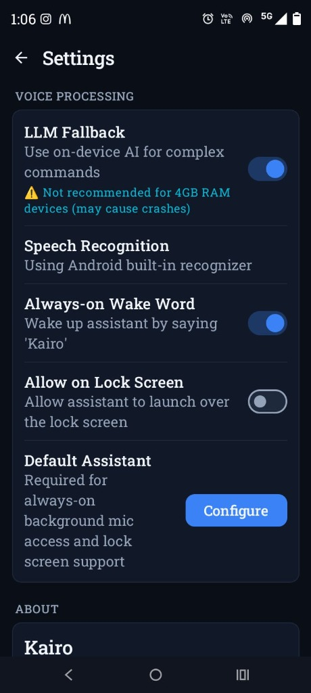
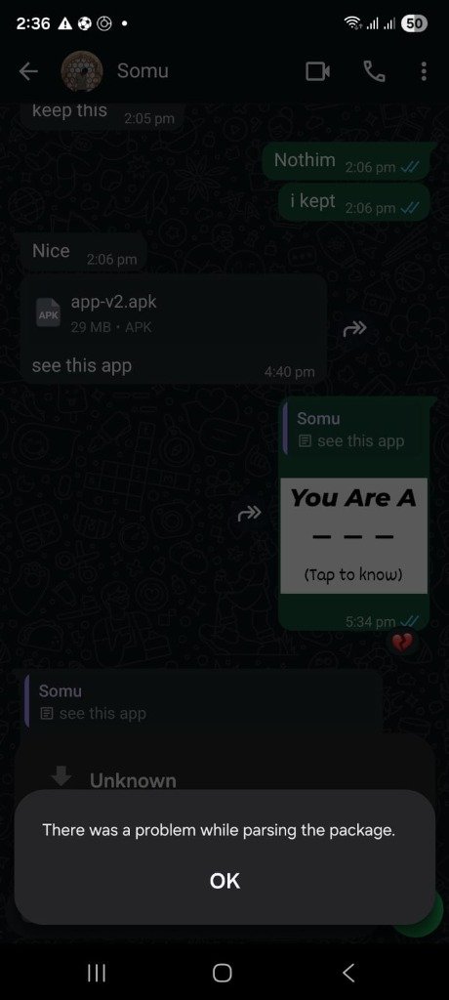

# Kairo - Android Assistant

Kairo is an intelligent voice assistant for Android, built using Jetpack Compose, Kotlin Coroutines, and local on-device NLU/LLM inference.

### 📱 App Previews

| App Launch Screen | Active Orbiter Screen |
|:---:|:---:|
|  |  |

## How to Run the App

The fastest way to see the app in action is to install the pre-compiled, highly-optimized release APK directly on your Android device.

### 🚀 Fast Install: Pre-Compiled Release APK (1 Minute)

Since the app has been built and compiled with Baseline Profile pre-optimization rules, the final APK is ready:

1. **Locate the APK file** in the project root:
   * **[app-v2.apk](app-v2.apk)**
2. **Send the file** to your Android phone (via USB, Google Drive, email, etc.).
3. **Open the file** on your phone and tap **Install**.
   *(Note: You may need to allow "Install from Unknown Sources" in your phone's settings or file manager.)*
4. **Launch Kairo** and start testing!

---

### 💻 Running via Android Studio (Emulator or USB Debugging)

If you prefer to run the app from source code using an emulator or directly via USB debugging:

1. **Open Device Manager**:
   * Click the **hamburger menu** (three lines `☰`) at the top-left of Android Studio.
   * Navigate to **Tools** -> **Device Manager**.
2. **Create a Virtual Device**:
   * Click **Create Device** and use these recommended settings:
     * **Category**: `Phone`
     * **Device Name**: **`Pixel 8`** or **`Pixel 7`** (Select one with the **Play Store icon**, as the app requires Google Play Services for speech features).
     * **System Image**: Choose **`VanillaIceCream`** (API 35, Android 15.0) or **`UpsideDownCake`** (API 34, Android 14.0) from the **Recommended** tab.
     * **ABI**: **`x86_64`**
   * Click **Finish** to create the device.
3. **Run the App**:
   * Select your device from the dropdown in the top toolbar (e.g., `Pixel 8 API 35`).
   * Click the green **Run** button (play icon) to launch **Kairo**!

Alternatively, you can enable **USB Debugging** on your physical Android phone, connect it to your computer, and run it directly.
